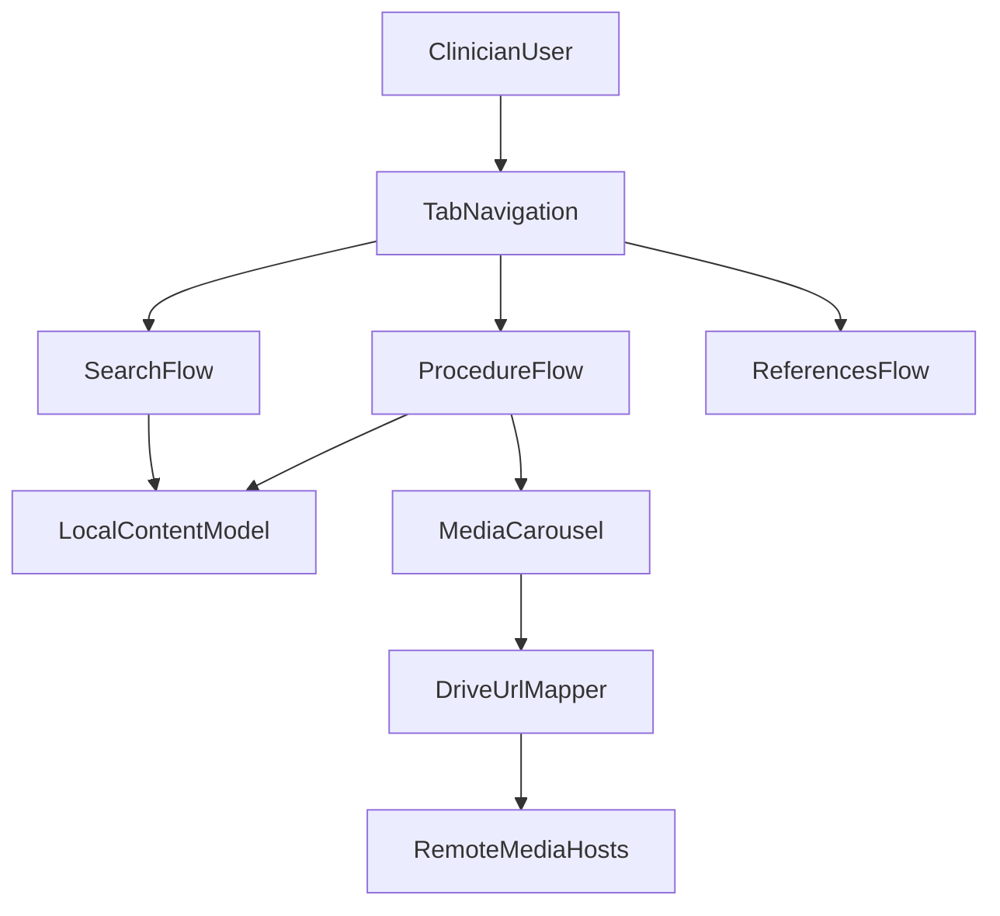

# Structural Heart App Architecture

This app is a mobile-first Expo Router client that serves procedural education content with mixed media.

## System overview

## Major mechanics

- **Routing and navigation**
  - Root stack and theming: [`app/_layout.tsx`](../app/_layout.tsx)
  - Tab layout (`Procedures`, `Search`, `References`): [`app/(tabs)/_layout.tsx`](../app/(tabs)/_layout.tsx)
  - Procedure path: `Category -> Subtopic -> Detail`: [`app/(tabs)/procedures/index.tsx`](../app/(tabs)/procedures/index.tsx), [`app/(tabs)/procedures/[categoryId].tsx`](../app/(tabs)/procedures/[categoryId].tsx), [`app/(tabs)/procedures/[categoryId]/[subtopicId].tsx`](../app/(tabs)/procedures/[categoryId]/[subtopicId].tsx)

- **Content and data model**
  - Domain model is bundled TypeScript, not backend-driven yet.
  - Types: [`types/media.ts`](../types/media.ts), content source: [`data/content.ts`](../data/content.ts)
  - Relationship: `Category[] -> Subtopic[] -> Slide[]` with optional nested `children`.

- **Media delivery and playback**
  - Carousel rendering for image/video/text slides: [`components/MediaCarousel.tsx`](../components/MediaCarousel.tsx)
  - Drive URL normalization to direct links: [`utils/drive.ts`](../utils/drive.ts)
  - Player reuse between inline and fullscreen to reduce restart/download churn: [`utils/videoPlayerCache.ts`](../utils/videoPlayerCache.ts)
  - Fullscreen and orientation transitions in detail screen and hook: [`app/(tabs)/procedures/[categoryId]/[subtopicId].tsx`](../app/(tabs)/procedures/[categoryId]/[subtopicId].tsx), [`hooks/useOrientationFullscreen.ts`](../hooks/useOrientationFullscreen.ts)

- **Search behavior**
  - Client-side fuzzy search using Fuse over flattened category subtopics: [`app/(tabs)/search/index.tsx`](../app/(tabs)/search/index.tsx)

## Mobile-first design choices

- Uses native tabs and stack transitions instead of web-first navigation.
- Uses fullscreen media modal and orientation-aware behavior for procedural videos.
- Keeps content local for fast startup and deterministic UX in low-connectivity environments.

## Current limitations

- No backend or CMS for managed content lifecycle.
- Remote media currently includes Google Drive links; this is not ideal for long-term reliability.
- Search index does not currently recurse into all nested child levels.
